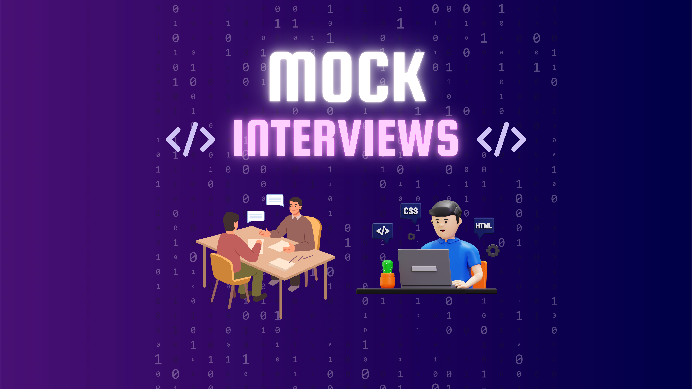

# 💻 Joshua Reid Adams

📍 Cape Town, South Africa  
📧 230317693@mycput.ac.za  
📞 +27 67 653 1002  
🔗 GitHub: https://github.com/JoshBlack25  

---

## 👨‍💻 About Me

I am a Diploma in Application Development student at the Cape Peninsula University of Technology (CPUT). I focus on building practical, structured software solutions that solve real problems.

With experience in customer service and teamwork-driven environments, I bring communication skills, discipline, and problem-solving ability into my development work. I am working toward becoming a capable and industry-ready software developer.

---

## 🛠️ Technical Skills

- Java (JDBC, desktop applications)
- JavaScript
- HTML5 & CSS3
- Python
- React (basic)
- MySQL
- Linux

---

## 🚀 Featured Projects

### 📌 Student Enrollment System
Java desktop application for managing student registrations and course data.

**Tech:** Java, JDBC, MySQL  

---

### 📌 Campus Companion
A timetable management system designed to help students organise their schedules.

**Tech:** Java, JDBC, MySQL  

---

### 📌 Personal Portfolio Website
A responsive website showcasing my skills and projects.

**Tech:** HTML5, CSS3, JavaScript  

---

### 📌 Future Foundations
A charity organisation website developed as part of my learning journey.

**Tech:** HTML5, CSS3, JavaScript  

---

## 🎥 Mock Interview Video

### Watch my presentation below:

---

### 📌 Video Notes
- If the video does not play in the browser, it can be accessed directly from the repository `/assets` folder.
- Ensure the file is uploaded correctly to GitHub under the `assets` directory.

---

## 📄 Curriculum Vitae (CV)

👉 [View My CV](cv.md)

---

## 🧠 Reflective Practice

This portfolio includes structured reflections using the STAR method:

- Mock Interview Reflection  
- Markdown & GitHub Pages Learning Reflection  
- General Development Reflection  

👉 [Read Reflections](interview.md)

---

## 🌐 GitHub Pages Deployment

This portfolio is deployed using GitHub Pages.

🔗 Live Site:  
https://joshblack25.github.io/JoshuaReidAdams-Portfolio/

---

## 📌 Portfolio Purpose

This portfolio demonstrates:

- Technical software development skills  
- Ability to use GitHub and Markdown effectively  
- Reflection on learning and professional growth  
- Readiness for the ICT workplace  

---

## 🙌 References

Available upon request